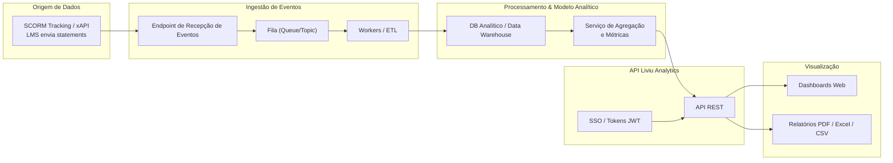
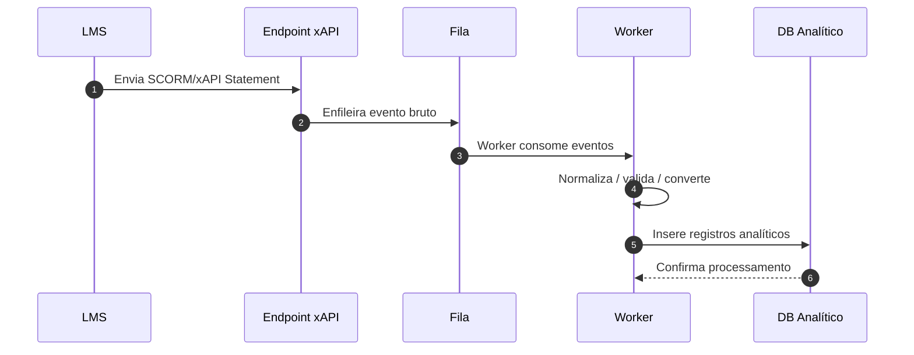
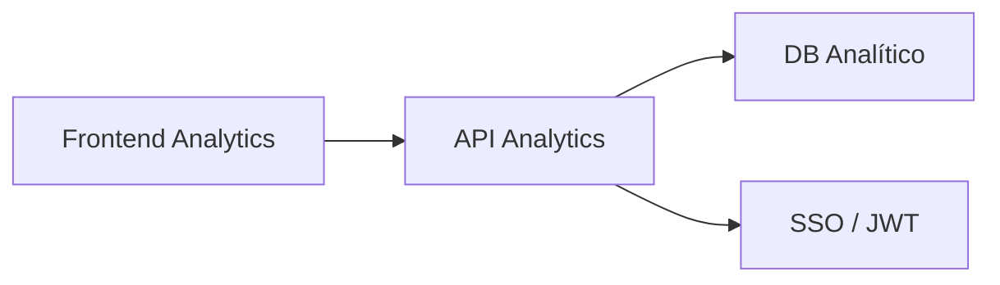

# Arquitetura — Liviu Analytics

Esta página descreve a arquitetura do **Liviu Analytics**, considerando sua operação atual:  
**todos os dados consumidos pelo Analytics vêm exclusivamente do SCORM Tracking**, através de eventos xAPI/SCORM enviados pelo LMS para o backend da AdaptEdTech.

A seguir, você encontrará a visão completa dos componentes, processamento e visualização.

---

## Visão Geral da Arquitetura

O fluxo do Liviu Analytics é composto por:

-   **SCORM Tracking (xAPI/Statements)** → única origem de dados
-   **Camada de Ingestão (evento → fila → worker)**
-   **Camada de Processamento e Normalização**
-   **Banco Analítico (data warehouse)**
-   **API do Liviu Analytics**
-   **Dashboards / Relatórios (Frontend)**
-   **Segurança e SSO**

---

## Diagrama de Alto Nível

---

## Componentes Principais

### 1. Origem de Dados: SCORM Tracking

O Liviu Analytics recebe apenas eventos SCORM/xAPI enviados pelo LMS:

-   `Page viewed`
-   `Module launched`
-   `Module completed`
-   `Passed / Failed`
-   `Question answered`
-   `Time spent`
-   `Interaction data`
-   `Progress %`

### 2. Camamada de Ingestão

Responsável por:

-   Receber os eventos SCORM enviados pelo LMS
-   Validar estrutura
-   Enfileirar para processamento
-   Garantir resiliência caso haja picos de tráfego

Fluxo resumido:

### 3. API Liviu Analytics

A API expõe endpoints para:

-   Engajamento
-   Conclusão
-   Evolução de conteúdo
-   Performance
-   Interações
-   Relatórios
-   Filtros avançados (empresa, turma, conteúdo, período)

Fluxo:

### 4. Visualização (Dashboards e Relatórios)

O frontend consome a API para renderizar:

-   Indicadores gerais
-   Taxas de conclusão
-   Tempo médio estudado
-   Progresso por trilha
-   Performance em questões
-   Picos e quedas de engajamento

---

## Segurança e SSO

-   Autenticação central via Auth/SSO AdaptEdTech

-   Tokens JWT com:

    -   Empresa
    -   Permissões
    -   Escopo
    -   Perfil

-   Consultas sempre filtradas por tenant
-   Auditoria de requisições

---

## Observabilidade

Monitoramento cobre:

-   Falhas de ingestão SCORM
-   Atraso de workers
-   Eventos inválidos
-   Tempo de processamento por lote
-   Latência das APIs
-   Load dos dashboards

---

## CI/CD

Pipeline:

-   Validar ingestão
-   Testar conversões SCORM → analítico
-   Aplicar migrações de schema
-   Deploy da API
-   Deploy do frontend
