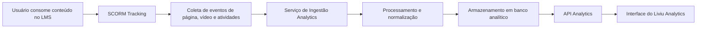

# Arquitetura Técnica — Liviu Analytics

O Liviu Analytics é responsável por processar, armazenar e exibir dados de navegação, engajamento, atividades e vídeos provenientes dos conteúdos publicados no LMS.  
Esta arquitetura foi atualizada com a estrutura e fluxo atual do produto.

---

# 1. Visão Geral da Arquitetura

O módulo é composto por quatro camadas principais:

1. Coleta de dados (SCORM Tracking e eventos de leitura)
2. Processamento e normalização dos eventos
3. Armazenamento dos dados analíticos
4. Consultas e exibição no painel do Liviu Analytics

Ele se integra nativamente com o LMS da AdaptEdTech e com o Liviu Content.

---

# 2. Fluxo Geral de Funcionamento

A seguir está o fluxo completo dos dados, desde o usuário consumindo conteúdo até a exibição no painel:

# 3. Coleta de Dados

A coleta de dados do Liviu Analytics ocorre diretamente a partir do consumo dos conteúdos publicados no LMS. Cada interação do usuário dentro do player gera eventos que são enviados ao servidor de Tracking.

Os principais tipos de eventos coletados são:

## 3.1 Eventos de Página

-   entrada em uma página
-   saída de uma página
-   tempo ativo dentro da página
-   tempo ocioso
-   ordem de navegação

## 3.2 Eventos de Vídeo

-   iniciar reprodução
-   pausar
-   continuar
-   finalizar
-   porcentagem assistida
-   trechos mais assistidos

## 3.3 Eventos de Atividade

Dependendo do conteúdo, podem incluir:

-   respostas a questões internas
-   ações dentro de atividades interativas
-   registros de envio

## 3.4 Tecnologias Utilizadas na Coleta

-   SCORM 1.2
-   SCORM 2004
-   Eventos proprietários do player AdaptEdTech
-   Webhooks internos

Os dados são enviados automaticamente pelo LMS, sem necessidade de configuração manual do usuário.

---

# 4. Pipeline de Ingestão

Os eventos enviados pelo LMS passam por um pipeline de ingestão responsável por processar e transformar as informações antes de armazená-las.

O pipeline inclui:

## 4.1 Validação

-   Estrutura dos eventos
-   Autenticação da origem
-   Presença de campos obrigatórios

## 4.2 Normalização

Todos os eventos são convertidos para um formato padronizado que facilita consultas e agregações.

Exemplos:

-   conversão de timestamps
-   limpeza de campos
-   identificação da sessão do usuário

## 4.3 Enriquecimento

O serviço complementa os eventos com metadados como:

-   conteúdo associado
-   tenant/empresa
-   configuração do relatório
-   sessão do usuário
-   versão do conteúdo

## 4.4 Armazenamento Inicial

Os dados normalizados são inseridos em tabelas de eventos crus (`raw_events`) antes de serem processados para agregações.

---

# 5. Banco de Dados Analítico

O banco analítico é otimizado para consultas rápidas e agregações complexas. Ele armazena desde eventos brutos até indicadores já calculados.

## 5.1 Camadas de Dados

### Dados Brutos (Raw)

-   eventos SCORM
-   eventos de vídeo
-   eventos de página
-   eventos de atividade

### Dados Processados (Processed)

-   sessões de navegação
-   tempo ativo
-   páginas visitadas
-   métricas consolidadas

### Dados Agregados (Aggregated)

-   média de páginas por acesso
-   tempo médio de acesso
-   tempo médio de ociosidade
-   desempenho de vídeos

## 5.2 Tabelas Principais

-   `raw_events`
-   `page_views`
-   `video_events`
-   `sessions`
-   `reports`
-   `reports_pages`
-   `reports_videos`
-   `reports_engagement`

## 5.3 Banco Suportado

O banco utilizado pode variar por cliente, mas a estrutura atual suporta:

-   PostgreSQL
-   TimescaleDB
-   Redshift
-   ClickHouse

---

# 6. API Analytics

A API é a responsável por fornecer todos os dados consumidos pela interface do Liviu Analytics. Ela recebe filtros, processa métricas e retorna as informações agregadas.

## 6.1 Funcionalidades Principais

-   criação de relatórios
-   listagem e organização
-   retorno de métricas por período
-   busca de páginas visitadas
-   dados de engajamento
-   dados de vídeo
-   dados de atividades
-   exportação de dados (quando habilitado)

## 6.2 Autenticação

A API utiliza:

-   autenticação via SSO
-   token JWT válido
-   verificação de permissões por tenant

## 6.3 Endpoints Principais

### Relatórios

-   GET `/reports`
-   POST `/reports`
-   GET `/reports/{id}`

### Dados Gerais

-   GET `/reports/{id}/stats`

### Páginas

-   GET `/reports/{id}/pages`

### Engajamento

-   GET `/reports/{id}/engagement`

### Atividades

-   GET `/reports/{id}/activities`

### Vídeos

-   GET `/reports/{id}/videos`

---

# 7. Interface do Liviu Analytics

A interface é responsável por transformar os dados da API em gráficos, tabelas e indicadores claros. Ela funciona como uma SPA (Single Page Application).

## 7.1 Estrutura Principal da Interface

A interface contém:

-   lista de relatórios
-   criação e organização de pastas
-   visualização completa do relatório
-   navegação por abas:
    -   Dados Gerais
    -   Engajamento
    -   Atividades
    -   Vídeos
-   filtros avançados de período
-   configurações do relatório

## 7.2 Elementos Internos

-   gráficos agregados
-   métricas principais
-   tabelas detalhadas
-   painel de páginas mais acessadas
-   análise de vídeos

---

# 8. Estrutura de Relatórios

Um relatório no Liviu Analytics é composto por:

## 8.1 Metadados

-   nome
-   descrição
-   criação e atualização
-   empresa/tenant
-   usuário responsável

## 8.2 Configurações

-   período padrão
-   abas habilitadas
-   conteúdos vinculados
-   permissões de acesso

## 8.3 Dados Analíticos

Cada relatório é gerado a partir dos eventos coletados e inclui:

-   métricas gerais
-   evolução temporal
-   página a página
-   vídeo a vídeo
-   atividades e interações

---

# 9. Tecnologias Utilizadas

O Liviu Analytics utiliza tecnologias modernas para garantir escala e segurança.

## 9.1 Backend

-   Python
-   FastAPI
-   Serviço de ingestão assíncrono
-   JWT
-   Integração SSO AdaptEdTech

## 9.2 Frontend

-   Framework SPA (React)
-   Recharts ou ECharts para gráficos
-   Comunicação via REST

## 9.3 Tracking

-   SCORM (1.2 e 2004)
-   Eventos proprietários
-   Player AdaptEdTech

---

# 10. Segurança e Controle de Acesso

O sistema aplica:

-   controle por tenant
-   permissões por usuário
-   tokens JWT
-   HTTPS obrigatório
-   isolamento completo entre clientes
-   logs de auditoria
-   proteção contra manipulação de eventos

---

# 11. Limitações e Observações

-   Dependência total dos eventos enviados pelo conteúdo SCORM.
-   Conteúdos que não enviam eventos não geram dados.
-   Vídeos externos podem não fornecer todos os eventos.
-   Relatórios dependem do período selecionado.
-   Dados podem ter atraso em ambientes com sincronização agendada.

