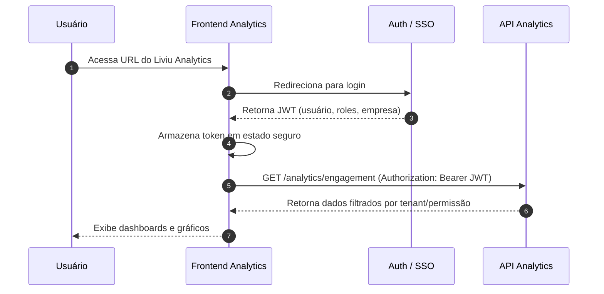

# Frontend — Liviu Analytics

O **frontend do Liviu Analytics** é a camada responsável por exibir, de forma visual e interativa, os dados processados pela API Analytics a partir dos eventos SCORM/xAPI.

Esta página descreve a visão técnica do frontend: responsabilidades, arquitetura, navegação, comunicação com a API e principais fluxos de tela.

> **Observação:** preencha os pontos marcados com `[...]` de acordo com a implementação real (framework, libs, endpoints específicos, etc).

---

## Stack Tecnológica

O frontend do Liviu Analytics é uma aplicação web moderna construída com:

-   **Framework SPA/SSR:** React
-   **Linguagem:** TypeScript / JavaScript
-   **Estilização:** Styled Components
-   **Gráficos:** Recharts
-   **Comunicação com API:** HTTP/REST via fetch/Axios
-   **Gerenciamento de estado:** Context API
-   **Build/Empacotamento:** Vite

A aplicação é entregue como **SPA (Single Page Application)** ou app SSR estático, consumindo apenas a **API Liviu Analytics**.

---

## Estrutura Geral do Frontend

Estrutura sugerida de pastas (ajustar para o projeto real):

---

## Autenticação e Sessão

O frontend consome o SSO/Auth central da AdaptEdTech, utilizando JWT.

Fluxo geral:

1. Usuário acessa a URL do Liviu Analytics.
2. Caso não esteja autenticado, é redirecionado para o provedor de login (SSO).
3. Após login bem-sucedido, o frontend recebe um token JWT.
4. O token é armazenado em um local seguro (estado em memória; evitar localStorage puro para dados sensíveis).

Todas as requisições para a API Analytics são feitas com:

```http
Authorization: Bearer <TOKEN>
```

### Diagrama do fluxo de autenticação



---

## Dashboards e Telas Principais

1. Dashboard de Engajamento

    - Cards com:
    - Acessos totais
    - Usuários ativos
    - Tempo de estudo
    - Gráfico de linhas com acessos diários
    - Tabela com conteúdos mais acessados
    - Filtros:
        - Período
        - Empresa/unidade
        - Conteúdo

2. Dashboard de Conclusão

    - Taxa de conclusão geral
    - Tabela com taxa de conclusão por conteúdo
    - Gráficos de barras comparando trilhas/cursos
    - Filtros equivalentes (período, empresa, etc.)

3. Dashboard de Performance
    - Score médio em quizzes
    - Questões com maior taxa de erro
    - Comparação entre grupos (equipes, turmas, etc.)
    - Detalhamento por conteúdo / trilha

---

## Boas Práticas

-   Nunca expor segredos no frontend (apenas URLs públicas da API).
-   Tratar expiração de token (redirigir para login).
-   Reutilizar componentes de gráfico e layout.
-   Garantir responsividade (desktop primeiro, mas adaptável a tablet).
-   Focar em:
    -   clareza visual
    -   contraste
    -   acessibilidade básica
    -   performance (evitar chamadas redundantes)
