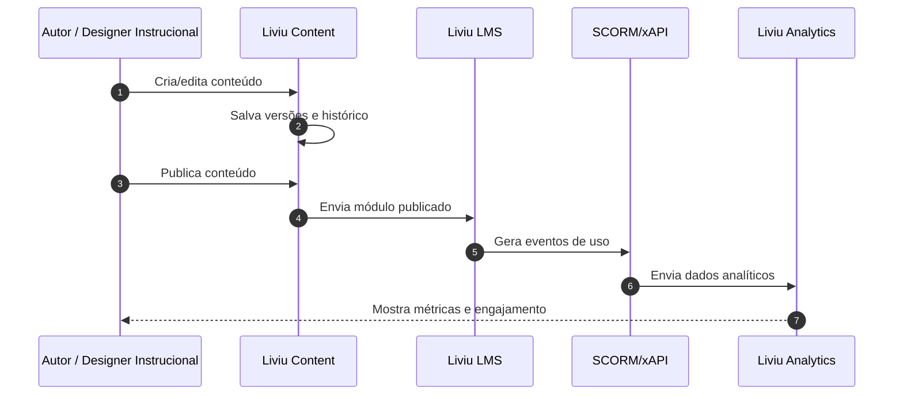

# Liviu Content — Visão Geral

O **Liviu Content** é o módulo da AdaptEdTech dedicado à criação, edição, organização e gestão de conteúdos educacionais, permitindo que equipes de T&D, designers instrucionais, redatores e especialistas transformem conhecimento em materiais de aprendizagem estruturados, multimídia e padronizados.

Ele foi desenvolvido para simplificar a produção educacional e garantir alta qualidade, consistência e escalabilidade para empresas e instituições que utilizam o ecossistema Liviu.

---

## Objetivos do Liviu Content

-   Facilitar a criação de conteúdos educacionais digitais.
-   Oferecer uma interface intuitiva para edição, organização e publicação.
-   Padronizar os materiais desenvolvidos pelas equipes.
-   Acelerar o processo de criação e revisão.
-   Integrar conteúdos diretamente com o **LMS**, **SCORM/xAPI** e outros módulos Liviu.
-   Permitir colaboração entre diferentes perfis (instrutor, redator, revisor).
-   Garantir rastreabilidade, histórico e controle de versões.

---

## Principais Funcionalidades

### 1. Editor de Conteúdo

Ferramentas para criação de materiais educacionais:

-   Editor rich-text com blocos (imagens, listas, tabelas, vídeos, cards).
-   Inclusão de quizzes embutidos.
-   Linkagem entre seções e módulos.
-   Importação de mídias e anexos.
-   Organização por seções, capítulos e trilhas.

### 2. Organização e Estruturação

-   Criação de cursos, módulos e unidades.
-   Arrastar e soltar (drag & drop).
-   Planejamento didático.
-   Organização por trilhas, temas e categorias.

### 3. Templates e Componentes

-   Modelos prontos para:
    -   páginas introdutórias,
    -   objetivos de aprendizagem,
    -   atividades práticas,
    -   quizzes,
    -   resumos visuais,
    -   avaliações.
-   Componentes reutilizáveis para padronização.

### 4. Colaboração e Revisão

-   Controle de versões.
-   Comparação entre versões antigas.
-   Comentários internos para revisores.
-   Workflow de aprovação (status):
    -   Em desenvolvimento
    -   Em revisão
    -   Aprovado
    -   Publicado

### 5. Exportação e Publicação

-   Publicação direta no LMS AdaptEdTech.
-   Exportação em:
    -   SCORM (1.2 / 2004)
    -   xAPI (quando aplicável)
    -   PDF (opcional)
-   Integração com o **Liviu Analytics** para gerar dados de uso.

---

## Integração com o Ecossistema Liviu

### Liviu LMS

O conteúdo criado no Liviu Content é consumido diretamente pelo LMS para:

-   Trilhas
-   Cursos
-   Avaliações
-   Módulos SCORM
-   Lições multimídia

### Liviu Analytics

O progresso dos alunos é registrado via SCORM/xAPI e aparece nos dashboards de:

-   Engajamento
-   Conclusão
-   Performance

### Liviu Flow

Tarefas de criação e revisão podem ser associadas a projetos no Flow.

---

## Fluxo Geral do Usuário

---

## Arquitetura (Resumo)

A arquitetura do Liviu Content é composta por:

-   Frontend: aplicação web para criação e edição de conteúdos
-   Backend: APIs de conteúdos, templates, mídias e revisão
-   Storage: repositório de conteúdos + arquivos estáticos
-   Publicação: integração direta com o LMS
-   Versão/Histórico: banco próprio com versionamento incremental

---

## Perfis de Usuário

-   Administrador: gerencia equipes, permissões e categorias.
-   Designer Instrucional: cria e estrutura os conteúdos.
-   Redator: escreve textos e revisa materiais.
-   Revisor/Formador: revisa e aprova conteúdos.
-   Gestor de T&D: monitora progresso e acompanha status.
