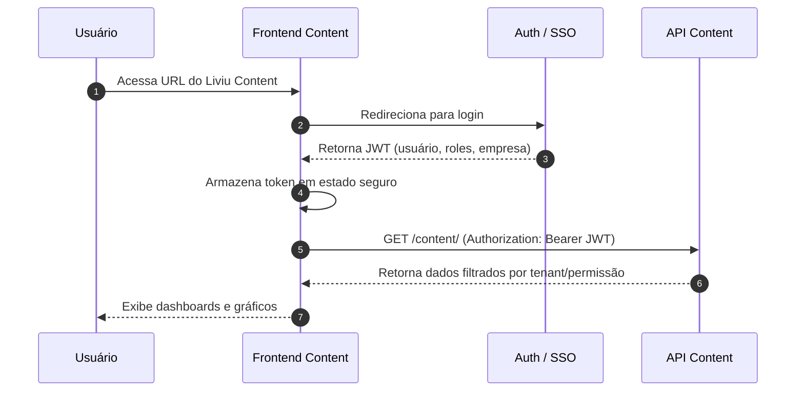

# Frontend — Liviu Content

O frontend do Liviu Content é a aplicação responsável por toda a experiência de criação, edição, organização e publicação dos conteúdos educacionais produzidos pelas equipes de T&D, DI e especialistas.  
Ele funciona como uma SPA (Single Page Application) moderna, interativa e altamente otimizada para edição de grandes quantidades de conteúdo.

---

# Objetivo do Frontend

- Permitir criação e edição de conteúdos de forma visual e intuitiva.  
- Gerenciar módulos, unidades, trilhas e páginas.  
- Criar e manipular blocos de conteúdo.  
- Realizar revisões, versionamento e aprovações.  
- Publicar conteúdos diretamente no LMS.  
- Integrar-se ao Liviu Flow para gestão de tarefas.  

---

## Stack Tecnológica

O frontend do Liviu Content é uma aplicação web moderna construída com:

-   **Framework SPA/SSR:** React
-   **Linguagem:** TypeScript / JavaScript
-   **Estilização:** Styled Components
-   **Comunicação com API:** HTTP/REST via fetch/Axios
-   **Gerenciamento de estado:** Context API
-   **Build/Empacotamento:** Webpack

A aplicação é entregue como **SPA (Single Page Application)** ou app SSR estático, consumindo apenas a **API Liviu Content**.

---

## Estrutura Geral do Frontend

Estrutura sugerida de pastas (ajustar para o projeto real):

---

## Autenticação e Sessão

O frontend consome o SSO/Auth central da AdaptEdTech, utilizando JWT.

Fluxo geral:

1. Usuário acessa a URL do Liviu Content.
2. Caso não esteja autenticado, é redirecionado para o provedor de login (SSO).
3. Após login bem-sucedido, o frontend recebe um token JWT.
4. O token é armazenado em um local seguro (estado em memória; evitar localStorage puro para dados sensíveis).

Todas as requisições para a API Content são feitas com:

```http
Authorization: Bearer <TOKEN>
```

### Diagrama do fluxo de autenticação



---

## Boas Práticas

-   Nunca expor segredos no frontend (apenas URLs públicas da API).
-   Tratar expiração de token (redirigir para login).
-   Reutilizar componentes de gráfico e layout.
-   Garantir responsividade (desktop primeiro, mas adaptável a tablet).
-   Focar em:
    -   clareza visual
    -   contraste
    -   acessibilidade básica
    -   performance (evitar chamadas redundantes)
