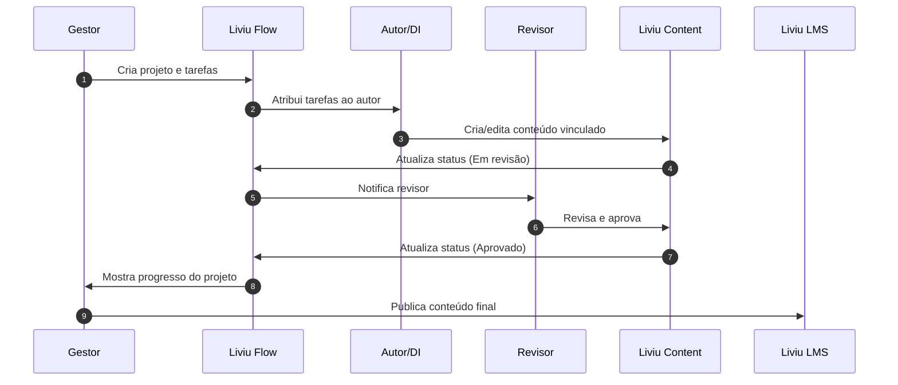

# Liviu Flow — Visão Geral

O **Liviu Flow** é o módulo da AdaptEdTech criado para organizar, gerenciar e acompanhar todo o fluxo de produção educacional. É ideal para equipes de T&D, design instrucional, redação, revisão e gestão que precisam estruturar processos e garantir entregas consistentes.

Ele centraliza tarefas, cronogramas, prioridades e status em um único espaço, garantindo maior produtividade e visibilidade sobre projetos educacionais.

---

## Objetivos do Liviu Flow

-   Organizar atividades e processos educacionais.
-   Acompanhar o andamento de projetos (cursos, trilhas, materiais).
-   Facilitar colaboração entre DI, revisores, redatores e gestores.
-   Garantir prazos claros e visão de responsabilidade.
-   Integrar tarefas diretamente com o **Liviu Content**.
-   Aumentar a eficiência da equipe e reduzir retrabalho.
-   Criar transparência na cadeia de produção de conhecimento.

---

## Principais Funcionalidades

### 1. Gestão de Projetos

Criação e acompanhamento de projetos, como:

-   cursos completos
-   trilhas
-   módulos
-   materiais especiais
-   campanhas internas

Cada projeto pode conter:

-   descrição
-   responsáveis
-   prazos
-   categorias
-   status

---

### 2. Tarefas e Subtarefas

Cada etapa do trabalho pode ser dividida em tarefas claras:

-   rascunho
-   revisão
-   aprovação
-   criação de mídia
-   atualização de conteúdo
-   exportação
-   publicação

As tarefas podem ter:

-   responsável
-   prioridade
-   checklist
-   arquivos anexados
-   comentários
-   datas de entrega

---

### 3. Workflow Personalizável

Fluxos podem ser customizados conforme a empresa:

-   **Backlog → Em produção → Em revisão → Ajustes → Aprovado → Concluído**
-   Status ilimitados podem ser criados.
-   Times podem definir fluxos diferentes para projetos diferentes.

---

### 4. Comunicação Integrada

-   Comentários por tarefa
-   Marcações (@usuario)
-   Notificações automáticas
-   Histórico de alterações

---

### 5. Integração com Liviu Content

O Flow se integra diretamente com o Content:

-   Tarefas podem estar vinculadas a um conteúdo ou módulo.
-   Ao concluir uma tarefa, o status do conteúdo pode ser atualizado automaticamente.
-   O revisor pode navegar do Flow diretamente para o editor.

Fluxo simplificado:

```text
Tarefa no Flow → Edição no Content → Revisão → Aprovação → Publicação
```

---

### 6. Calendário e Cronograma

-   Visualização mensal/semanal das entregas
-   Linha do tempo (timeline) dos projetos
-   Acompanhamento de prazos
-   Alertas de atraso

---

### 7. Categorias, Etiquetas e Prioridade

As tarefas podem ser organizadas por:

-   tags
-   categorias
-   prioridades (baixa, média, alta, urgente)
-   departamentos
-   trilhas

---

### 8. Gestão de Equipes

-   visão por responsável
-   tarefas por área
-   produtividade por equipe
-   relatórios de carga de trabalho
-   acompanhamento de quem está sobrecarregado

---

### 9. Relatórios e Indicadores

O Flow permite acompanhar:

-   tarefas concluídas
-   tarefas atrasadas
-   tempo médio de execução
-   produtividade individual e da equipe
-   gargalos do processo
-   etapas que mais geram retrabalho

---

## Integração com o Ecossistema Liviu

O Flow funciona como o hub de produção educacional, integrando-se a:

### Liviu Content

-   criação e edição de conteúdo
-   vinculação automática de tarefas a módulos
-   atualização de status entre plataformas

### Liviu Analytics

-   análise da produtividade da equipe
-   medição de tempo de criação por projeto
-   identificação de gargalos

---

## Fluxo Geral de Trabalho



---

## Recursos Adicionais

-   Atalhos para produtividade
-   Filtros avançados
-   Painel de carga de trabalho
-   Histórico de alterações
-   Exportação de relatórios
-   Notificações por e-mail
