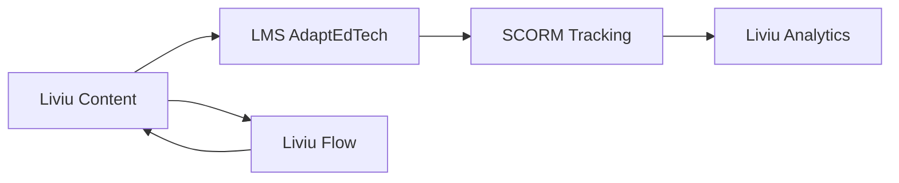

# Comece Aqui — Quick Start

Bem-vindo à documentação oficial da **AdaptEdTech – Ecossistema Liviu**.  
Esta página é o ponto de partida para você entender rapidamente **como o Liviu funciona**, qual módulo utilizar, e onde encontrar cada tipo de documentação.

Aqui você encontrará uma visão clara e objetiva do que fazer **dependendo do seu perfil** (usuário, desenvolvedor, gestor, integrador) e dos seus objetivos dentro da plataforma.

---

## O que é o Ecossistema Liviu?

O ecossistema Liviu é formado por produtos que trabalham juntos para criar, gerenciar, publicar, acompanhar e analisar conteúdos educacionais digitais.

Ele é composto por:

-   **Liviu Content** – Criação e edição de conteúdos
-   **Liviu Flow** – Gestão de tarefas, projetos e produção
-   **Liviu Analytics** – Métricas, engajamento, relatórios e dados de uso
-   **LMS AdaptEdTech** – Ambiente de execução e entrega dos conteúdos

Cada módulo tem documentação dedicada e este guia vai te ajudar a navegar por tudo isso.

---

## Para quem é essa documentação?

Escolha abaixo o seu perfil para seguir diretamente para o conteúdo mais importante para você.

### Usuários (T&D, DI, Produtores, Revisores)

Se você **produz conteúdo** ou **acompanha tarefas**, comece por aqui:

-   Liviu Content → Primeiros Passos
-   Liviu Flow → Primeiros Passos
-   Liviu Analytics → Primeiros Passos
-   Guia Completo do Usuário de cada módulo

### Desenvolvedores (Frontend, Backend, Full Stack)

Se você vai **integrar, consumir APIs ou contribuir tecnicamente**, comece por aqui:

-   Arquitetura Técnica de cada módulo
-   Documentação da API (Content, Flow, Analytics)
-   Frontend Architecture for Developers
-   Estrutura de Repositórios

### Integradores / Equipes Externas

Se você precisa conectar o Liviu com sistemas externos:

-   API do Liviu Content
-   API do Liviu Analytics
-   API do Liviu Flow
-   Especificações de Autenticação (SSO + JWT)

### Gestores e Coordenadores

Se você precisa **acompanhar a operação e o status dos projetos**:

-   Visão Geral do Ecossistema
-   Como usar o Flow para gerenciar produção
-   Como acompanhar métricas no Analytics

---

## Como Navegar pela Documentação

A documentação é dividida em **quatro grandes áreas**:

### Documentação do Usuário

Explica:

-   como usar cada módulo
-   fluxos comuns
-   telas, exemplos e orientações
-   primeiros passos
-   FAQ

Para usuários não técnicos.

### Documentação Técnica

Inclui:

-   arquitetura
-   APIs
-   estrutura de dados
-   fluxos internos
-   integração com outros sistemas
-   padrões de desenvolvimento

Para devs, integradores e equipes técnicas.

### Guias de Fluxos

Mostram:

-   como os módulos trabalham juntos
-   processos internos
-   boas práticas
-   fluxo de aprovação, revisão e publicação

### Exemplos e Casos de Uso

Em breve:

-   tutoriais passo a passo
-   exemplos de integração real
-   templates de conteúdo
-   exemplos de chamadas API

---

## O que eu faço primeiro?

Depende de quem você é 👇

### Se você é **Designer Instrucional / T&D / Conteudista**

1. Comece por **Liviu Content – Primeiros Passos**
2. Leia o **Guia Completo do Usuário**
3. Veja os **fluxos de publicação**
4. Leia como integrar com o Flow (tarefas)
5. Aprenda a acompanhar dados no Analytics

### Se você é **Produtor / Revisor / Operacional**

1. Vá para o **Liviu Flow – Primeiros Passos**
2. Aprenda o fluxo de aprovação, revisão e entrega
3. Leia o **Guia de Fluxos** (revisão, ajustes, concluído)
4. Acompanhe tarefas vinculadas ao Content

### Se você é **Desenvolvedor / Time Técnico**

1. Comece pela **Arquitetura do Ecossistema**
2. Consulte:
    - API do Content
    - API do Flow
    - API do Analytics
3. Veja:
    - Autenticação (SSO + JWT)
    - Estrutura dos módulos
    - Documentação do frontend

### Se você é **Gestor / Coordenador**

1. Entenda o ecossistema (esta página)
2. Aprenda a visualizar tarefas no Flow
3. Consulte relatórios-chave no Analytics
4. Leia o guia “Como gerenciar produção pelo Flow”

---

## Termos Importantes

| Termo              | Significado                                                   |
| ------------------ | ------------------------------------------------------------- |
| **Conteúdo**       | Arquivo ou curso criado no Liviu Content                      |
| **Sessão**         | Ações do usuário ao acessar o conteúdo                        |
| **Tracking SCORM** | Dados enviados ao Analytics                                   |
| **Tarefa**         | Unidade de trabalho dentro do Flow                            |
| **Projeto**        | Grupo de tarefas com objetivo comum                           |
| **Versão**         | Estado do conteúdo ao longo do tempo                          |
| **Workflow**       | Etapas de produção (backlog → revisão → aprovado → concluído) |

---

## Estrutura Geral do Ecossistema

---

## Seções Importantes

Abaixo estão os principais links para ajudar você a continuar sua jornada:

-   Liviu Content

    -   Primeiros Passos
    -   Guia do Usuário
    -   API
    -   Arquitetura

-   Liviu Flow

    -   Primeiros Passos
    -   Guia do Usuário
    -   API
    -   Arquitetura

-   Liviu Analytics
    -   Primeiros Passos
    -   Guia do Usuário
    -   Arquitetura
    -   API

---

## Como Contribuir

Se você deseja sugerir melhorias:

-   abra uma issue no repositório da documentação
-   sinalize erro, sugestão ou atualização necessária
-   envie PR com melhorias (opcional)

---

## Suporte

Se precisar de ajuda:

-   consulte os FAQs
-   procure o responsável técnico do módulo
-   fale com o time AdaptEdTech
-   abra um ticket interno

---

## Próximos Passos

Agora escolha o módulo que deseja aprender:

-   Liviu Content – Primeiros Passos
-   Liviu Flow – Primeiros Passos
-   Liviu Analytics – Primeiros Passos
